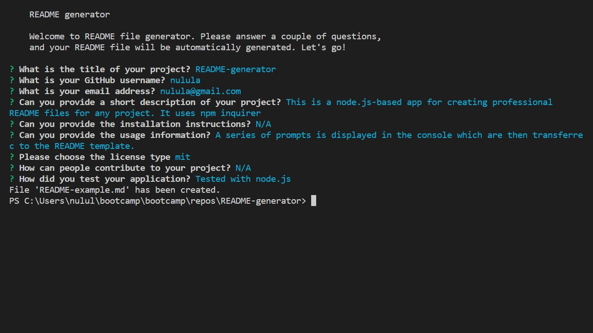

  # README-generator

  
  
  ## Description
  This is a node.js-based app for creating professional README files for any project. It uses npm inquirer
  ## Table of contents
  [Installation](#installation)
  
  [Usage](#usage)
  
  [License](#license)
  
  [Contribution](#contribution)
  
  [Screenshot](#screenshot)
  
  [Questions](#questions)
  
  ## Installation
  N/A
  ## Usage
  A series of prompts is displayed in the console which are then transferred to the README template. Please find an instruction video at (https://drive.google.com/file/d/1nmrEqnyf9AiQt3AtGSIrwrllhPCwbD1b/view)
  ## License
  mit
  ## Contribution
  N/A
  ## Screenshot
  
  ## Questions
  Repository adress: https://github.com/nulula
  
  Please direct questions to nulula@gmail.com
